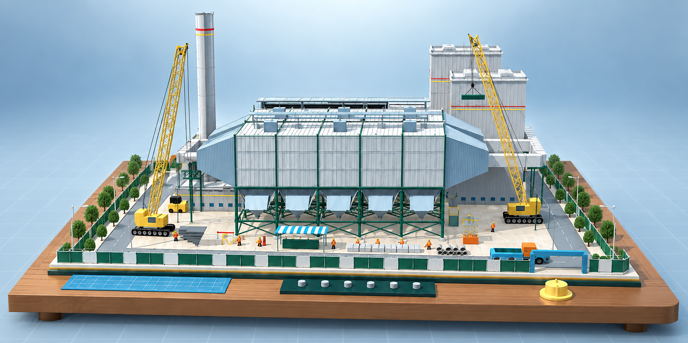
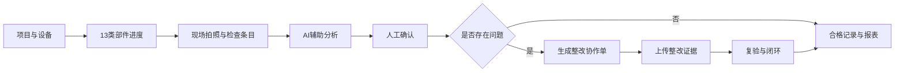
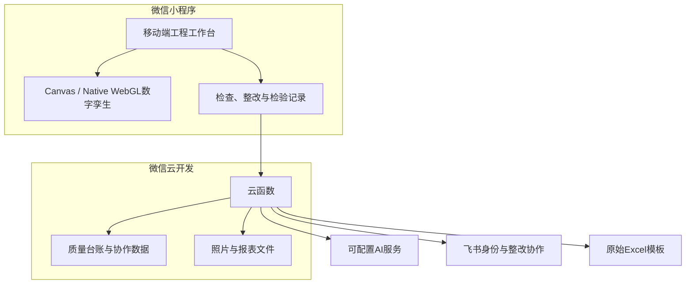

# 一款工程设备施工过程的数字孪生管理平台（关于工程设备类安装过程管理都可以参照此小程序来做企业落地）
> 我觉得做企业的FDM落地，一定要先把很多线下的工作先做到线上来，再想办法用AI进行提效以及后续的自动化。
> 面向火电厂电除尘器建设期的微信小程序，将施工进度可视化、AI质量检查、整改复验、工程台账与协作通知连接成一条现场闭环。

[](https://developers.weixin.qq.com/miniprogram/dev/framework/)
[](./components/construction-twin-3d/)
[](./tests/)
[](./LICENSE)



<p align="center"><sub>项目视觉封面；实际业务数据以小程序运行环境为准。</sub></p>
大家扫这个码就可以在小程序上进行体验。</sub></p>

## 小程序解决的痛点是
- 痛点 1：多平台数据分散，现场操作繁琐易错
现有工程管理数据分散在飞书多维表格、腾讯文档及各类业务系统中，进度、缺陷、检验、合同、资料等信息分属不同表单。表单搭建人员熟悉数据结构，但现场项目经理使用时，需要来回切换查找多张表格、定位对应项目条目再完成填报。随着表单数量增多，极易出现漏填信息、错选项目、重复催办等问题。
小程序实现各类业务表单的统一集中管理，项目经理打开小程序即可完成所属项目全维度管理，各类待办事项直观展示，降低操作成本与出错风险。
- 痛点 2：飞书对内够用，对外协同存在壁垒
现有项目管理主要依托飞书开展，能够满足公司内部办公协同需求。但项目现场管理需要对接外部施工班组等合作方，外部人员普遍使用微信，飞书平台对外接入不便。
依托微信小程序，内外部人员可在同一平台协同作业，例如现场发现施工缺陷，可直接通过小程序完成缺陷上报、闭环管理，打通对外协同链路。
- 痛点 3：纸质记录留痕难追溯，易丢失遗漏
项目大量关键节点需要过程留痕，如检验记录、纳米图层施工记录、煤油渗漏试验过程等，以往依靠纸质表单记录。纸质资料不仅容易遗失、漏记，后期查阅复盘也十分不便。
小程序串联项目全流程关键节点，所有业务操作线上化留存，实现过程数据完整留痕，方便随时查阅回溯。
- 痛点 4：业务缺乏标准化数据底座，难以开展 AI 辅助应用
传统工程管理模式下业务数据零散、格式不统一，不具备智能化分析的基础条件。借助小程序推动管理全过程的数据化，把项目各类业务行为转化为标准化结构化数据沉淀，在此基础上可引入 AI 辅助能力，将 AI 能力融入工程管理流程，实现智能化辅助研判，提升项目管理决策效率。

## 项目价值

传统电除尘安装管理中的进度、检查照片、缺陷整改和报表往往分散在不同人员与文件中。本项目围绕现场施工人员的手机操作，将这些信息按项目、设备和安装部件统一组织：

- 首页通过原生Canvas/WebGL沙盘展示当前施工范围，并按部件顺序回放建造过程。
- 13类安装部件与到货、安装进度、质量记录和缺陷状态关联。
- AI先检查照片质量与可见问题，人工确认后才形成正式记录。
- 整改单可通过微信开放协作，保留整改证据、复测结果和闭环时间线。
- 七类安装检验记录可回填到既有九工作表Excel模板，便于归档与打印。
- 云函数可衔接飞书协作、订阅提醒、质量台账和报告生成。

## 核心能力

| 能力 | 说明 |
| --- | --- |
| 施工数字孪生 | （方便汇报）原生WebGL程序化场景、360°环绕、双指缩放、部件点击、自动施工回放 |
| 13类部件进度 |（便于模块化管理） 当前部件只展示自身及此前部件，避免后续构件提前出现 |
| AI安装质检 | （AI识别缺陷）照片质量预检、检查条目分析、人工确认与结果留痕 |
| 整改复验闭环 | （线上留痕）待整改、整改中、已闭环、重新打开及跨微信协作 |
| 工程质量台账 | （线上留痕）记录、缺陷、照片、空间位置、部件节点和项目设备关联 |
| 原表Excel导出 |（格式统一） 在既有模板中回填封面、检查内容和附表1—7 |
| 飞书与消息协作 | （跨平台消息集成）身份绑定、整改回传、通知中心和订阅提醒部署能力 |
| 多项目/多设备 | (按项目进行分工管理)项目、机组、设备上下文切换及权限状态展示 |

## 当前数据规模

- 13类安装部件与88个设备/质量节点。
- 121条结构化安装质量检查标准。
- 7类安装检验记录，覆盖1,440个表单检查项。
- 9个工作表的原始Excel模板回填流程。
- 9个云端业务函数，覆盖AI、台账、报告、通知与飞书协作。

## 业务闭环



## 技术架构



更完整的模块说明见[系统架构](./docs/ARCHITECTURE.md)。

## 13类安装部件

1. 钢支架
2. 支座
3. 灰斗
4. 壳体
5. 楼梯平台
6. 阴阳极系统
7. 进出口喇叭
8. 保温箱
9. 灰斗纳米涂层
10. 振打系统
11. 电气安装
12. 顶部起吊系统
13. 调试


首页打开后会演示已安装的设备的安装过程，并定格到当前进度。

## 快速体验

### 运行要求

- 微信开发者工具稳定版。
- 支持`type="webgl"` Canvas的小程序基础库。
- Node.js 20+，仅用于运行仓库测试。

### 本地导入

```bash
git clone https://github.com/111117548/dccszls.git
cd dccszls
```

不使用 Git 的体验者可直接下载[当前版本源码包](https://github.com/111117548/dccszls/archive/refs/heads/main.zip)，解压后导入微信开发者工具。该链接始终对应 `main` 分支当前版本，仓库内不重复存放 ZIP。

1. 在微信开发者工具中选择“导入项目”。
2. 选择仓库根目录，项目类型选择“小程序”。
3. 使用自己的测试AppID，或按团队要求配置项目AppID。
4. 编译后可直接体验本地演示数据和数字孪生首页。

真实AI、跨设备协作、Excel下载、订阅提醒与飞书回传需要部署云函数。参见：

- [云开发部署说明](./docs/CLOUD-DEPLOYMENT.md)
- [飞书集成说明](./docs/FEISHU-INTEGRATION.md)

## 测试

无需安装第三方根依赖：

```bash
node --test tests/*.test.js
node tests/static-check.js
node tests/runtime-smoke.js
```

GitHub Actions会在推送和Pull Request时运行同一组核心检查。

## 仓库结构

```text
├─ components/                 小程序公共组件与原生WebGL孪生
├─ pages/                      首页、工作台、检查、整改、报告等页面
├─ cloudfunctions/             AI、质量台账、通知、飞书与报表云函数
├─ utils/                      领域模型、进度、质量与协作工具
├─ tests/                      业务回归、迁移和静态检查
└─ docs/                       架构、部署、集成、版本记录与宣传素材
```

## 演示数据与安全边界

- 仓库默认用于产品演示与开发验证，不包含生产密钥。
- AI返回内容必须经人工确认，不能直接替代工程质量验收结论。
- 数字孪生用于施工可视化和质量信息关联，不用于结构安全计算或运行诊断。
- 公开截图和演示数据不得包含真实人员、OpenID、整改证据或未授权项目资料。
- 上线前请按[安全说明](./SECURITY.md)检查AppID、云环境、密钥和数据库权限。

## Roadmap

- [x] 13类部件施工进度与原生WebGL沙盘
- [x] 首页施工回放、部件筛选、360°查看与真机渲染优化
- [x] AI辅助检查、质量台账和整改复验
- [x] 飞书协作、通知中心与Excel原表导出
- [ ] 经过授权的真实项目演示视频与小程序体验码
- [ ] 模型LOD、性能监控和更多机型真机基准
- [ ] 可配置的行业检查标准包

## 版本记录

当前仓库只保留可直接运行的最新代码。关键演进节点见[版本记录](./docs/CHANGELOG.md)，完整修改细节可通过 Git 提交历史追溯。

## 许可与品牌

本仓库当前用于展示与评估，未授予开源使用许可，详见[LICENSE](./LICENSE)。项目中出现的企业名称、标识和第三方服务商标归各自权利人所有；公开部署前请确认已获得相应授权。

---

**English summary:** A WeChat Mini Program for construction-phase electrostatic precipitator quality inspection, 13-component progress visualization, native WebGL digital-twin interaction, rectification workflow, Feishu collaboration and Excel report export.
